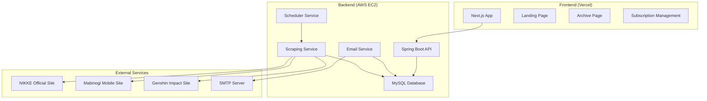
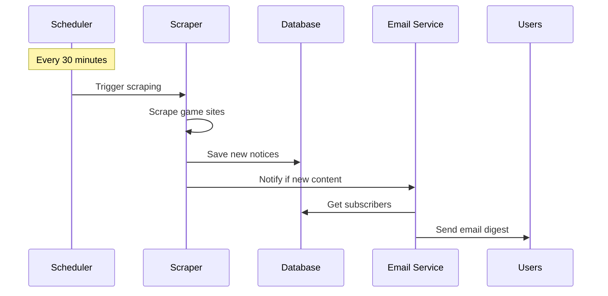

# Design Document

## Overview

KIKI는 승리의 여신 니케, 마비노기 모바일, 명조 게임의 공지사항을 30분마다 스크래핑하여 구독자들에게 이메일로 요약 정보를 제공하는 서비스입니다. Kotlin/Spring Boot 백엔드와 Next.js 프론트엔드로 구성된 풀스택 웹 애플리케이션으로 설계됩니다.

### 핵심 설계 원칙
- **단순성**: MVP 구현을 위한 최소한의 기능
- **확장성**: 추후 게임 추가가 용이한 구조
- **안정성**: 스크래핑 실패 시에도 서비스 지속
- **성능**: 30분 주기 실시간 처리

## Architecture

### 시스템 아키텍처



### 데이터 플로우



## Components and Interfaces

### 백엔드 컴포넌트

#### 1. 스크래핑 서비스 (ScrapingService)
```kotlin
interface GameScraper {
    fun scrapeNotices(): List<GameNotice>
    fun getGameName(): String
    fun getBaseUrl(): String
}

class NikkeScraper : GameScraper
class MabinogiMobileScraper : GameScraper  
class GenshinScraper : GameScraper
```

**설계 결정**: 각 게임별로 별도의 스크래퍼 클래스를 구현하여 사이트 구조 변경에 유연하게 대응

#### 2. 스케줄링 서비스 (SchedulingService)
```kotlin
@Component
class SchedulingService {
    @Scheduled(fixedRate = 1800000) // 30분 = 1800000ms
    fun executeScrapingJob()
}
```

#### 3. 이메일 서비스 (EmailService)
```kotlin
interface EmailService {
    fun sendDailyDigest(notices: List<GameNotice>)
    fun sendSubscriptionConfirmation(email: String)
}
```

#### 4. 구독 관리 서비스 (SubscriptionService)
```kotlin
interface SubscriptionService {
    fun subscribe(email: String): SubscriptionResult
    fun unsubscribe(token: String): Boolean
    fun getActiveSubscribers(): List<Subscriber>
}
```

### 프론트엔드 컴포넌트

#### 1. 랜딩 페이지 컴포넌트
- **SubscriptionForm**: 이메일 입력 및 구독 처리
- **HeroSection**: 서비스 소개 및 가치 제안
- **FeatureCards**: 주요 기능 소개 (Glassmorphism 적용)

#### 2. 아카이브 페이지 컴포넌트  
- **NoticeList**: 게임별 공지사항 목록 (Soft UI 적용)
- **FilterBar**: 날짜/게임별 필터링
- **NoticeCard**: 개별 공지사항 카드

## Data Models

### 데이터베이스 스키마

#### 1. Game 테이블
```sql
CREATE TABLE games (
    id BIGINT PRIMARY KEY AUTO_INCREMENT,
    name VARCHAR(100) NOT NULL UNIQUE,
    base_url VARCHAR(500) NOT NULL,
    scraper_class VARCHAR(200) NOT NULL,
    is_active BOOLEAN DEFAULT TRUE,
    created_at TIMESTAMP DEFAULT CURRENT_TIMESTAMP
);
```

#### 2. GameNotice 테이블
```sql
CREATE TABLE game_notices (
    id BIGINT PRIMARY KEY AUTO_INCREMENT,
    game_id BIGINT NOT NULL,
    title VARCHAR(500) NOT NULL,
    url VARCHAR(1000) NOT NULL UNIQUE,
    summary TEXT,
    published_date DATETIME NOT NULL,
    scraped_at TIMESTAMP DEFAULT CURRENT_TIMESTAMP,
    is_sent BOOLEAN DEFAULT FALSE,
    FOREIGN KEY (game_id) REFERENCES games(id),
    INDEX idx_published_date (published_date),
    INDEX idx_is_sent (is_sent)
);
```

#### 3. Subscriber 테이블
```sql
CREATE TABLE subscribers (
    id BIGINT PRIMARY KEY AUTO_INCREMENT,
    email VARCHAR(255) NOT NULL UNIQUE,
    unsubscribe_token VARCHAR(100) NOT NULL UNIQUE,
    is_active BOOLEAN DEFAULT TRUE,
    subscribed_at TIMESTAMP DEFAULT CURRENT_TIMESTAMP,
    INDEX idx_email (email),
    INDEX idx_is_active (is_active)
);
```

#### 4. EmailLog 테이블
```sql
CREATE TABLE email_logs (
    id BIGINT PRIMARY KEY AUTO_INCREMENT,
    subscriber_id BIGINT NOT NULL,
    sent_at TIMESTAMP DEFAULT CURRENT_TIMESTAMP,
    notice_count INT NOT NULL,
    status ENUM('SUCCESS', 'FAILED') NOT NULL,
    error_message TEXT,
    FOREIGN KEY (subscriber_id) REFERENCES subscribers(id)
);
```

### JPA 엔티티 설계

```kotlin
@Entity
@Table(name = "games")
data class Game(
    @Id @GeneratedValue(strategy = GenerationType.IDENTITY)
    val id: Long = 0,
    
    @Column(unique = true, nullable = false)
    val name: String,
    
    @Column(name = "base_url", nullable = false)
    val baseUrl: String,
    
    @Column(name = "scraper_class", nullable = false)
    val scraperClass: String,
    
    @Column(name = "is_active")
    val isActive: Boolean = true,
    
    @OneToMany(mappedBy = "game", cascade = [CascadeType.ALL])
    val notices: List<GameNotice> = emptyList()
)
```

## Error Handling

### 스크래핑 오류 처리 전략

1. **개별 게임 스크래핑 실패**
   - 다른 게임 스크래핑 계속 진행
   - 실패 로그 기록 및 알림
   - 3회 연속 실패 시 관리자 알림

2. **네트워크 오류**
   - 지수 백오프를 통한 재시도 (1초, 2초, 4초)
   - 최대 3회 재시도 후 실패 처리

3. **파싱 오류**
   - 사이트 구조 변경 감지
   - 기본값으로 대체 처리
   - 관리자에게 즉시 알림

### 이메일 발송 오류 처리

1. **SMTP 서버 오류**
   - 1시간 후 재시도
   - 실패한 이메일 목록 별도 저장

2. **개별 이메일 실패**
   - 유효하지 않은 이메일 주소 자동 비활성화
   - 반송 이메일 처리

## Testing Strategy

### 단위 테스트 (Unit Tests)

1. **스크래퍼 테스트**
   - Mock HTML 응답을 통한 파싱 로직 검증
   - 각 게임별 스크래퍼 독립 테스트

2. **서비스 레이어 테스트**
   - 비즈니스 로직 검증
   - Mock 의존성을 통한 격리 테스트

3. **이메일 템플릿 테스트**
   - HTML 템플릿 렌더링 검증
   - 다양한 데이터 시나리오 테스트

### 통합 테스트 (Integration Tests)

1. **API 엔드포인트 테스트**
   - 구독/구독취소 플로우 검증
   - 에러 응답 시나리오 테스트

2. **데이터베이스 통합 테스트**
   - JPA 엔티티 관계 검증
   - 트랜잭션 롤백 테스트

### E2E 테스트

1. **스크래핑 파이프라인 테스트**
   - 실제 사이트 대신 테스트 서버 사용
   - 전체 워크플로우 검증

2. **이메일 발송 테스트**
   - 테스트 SMTP 서버 활용
   - 이메일 내용 및 형식 검증

## 기술 스택별 상세 설계

### 백엔드 (Kotlin + Spring Boot)

#### 의존성 관리 (build.gradle.kts)
```kotlin
dependencies {
    implementation("org.springframework.boot:spring-boot-starter-web")
    implementation("org.springframework.boot:spring-boot-starter-data-jpa")
    implementation("org.springframework.boot:spring-boot-starter-mail")
    implementation("org.springframework.boot:spring-boot-starter-validation")
    implementation("mysql:mysql-connector-java")
    implementation("org.jsoup:jsoup:1.16.1")
    implementation("com.fasterxml.jackson.module:jackson-module-kotlin")
}
```

#### 스크래핑 구현 전략

**니케 (NIKKE)**
- 공식 사이트: `https://nikke-kr.com/`
- 공지사항 페이지 구조 분석 필요
- CSS 셀렉터 기반 파싱

**마비노기 모바일**
- 넥슨 공식 사이트 활용
- JSON API 엔드포인트 확인 우선
- HTML 파싱 백업 방안

**명조 (Genshin Impact)**
- HoYoverse 공식 사이트
- 다국어 지원 고려 (한국어 페이지)

### 프론트엔드 (Next.js)

#### 패키지 구성 (package.json)
```json
{
  "dependencies": {
    "next": "^14.0.0",
    "react": "^18.0.0",
    "tailwindcss": "^3.3.0",
    "framer-motion": "^10.0.0",
    "react-hook-form": "^7.45.0",
    "axios": "^1.5.0"
  }
}
```

#### UI 디자인 시스템

**Glassmorphism 구현**
```css
.glass-card {
  background: rgba(255, 255, 255, 0.1);
  backdrop-filter: blur(10px);
  border: 1px solid rgba(255, 255, 255, 0.2);
  border-radius: 16px;
}
```

**Soft UI 구현**
```css
.soft-card {
  background: #f0f0f3;
  box-shadow: 
    20px 20px 60px #d0d0d3,
    -20px -20px 60px #ffffff;
  border-radius: 20px;
}
```

### 배포 전략

#### 백엔드 (AWS EC2)
- **인스턴스 타입**: t3.micro (프리티어)
- **OS**: Amazon Linux 2
- **Java**: OpenJDK 17
- **데이터베이스**: RDS MySQL (t3.micro)
- **로드밸런서**: Application Load Balancer (선택사항)

#### 프론트엔드 (Vercel)
- **자동 배포**: GitHub 연동
- **CDN**: Vercel Edge Network
- **환경변수**: API 엔드포인트 설정

### 보안 고려사항

1. **API 보안**
   - CORS 설정
   - Rate Limiting
   - Input Validation

2. **이메일 보안**
   - 구독취소 토큰 암호화
   - SMTP 인증 정보 환경변수 관리

3. **데이터베이스 보안**
   - 연결 문자열 암호화
   - 최소 권한 원칙 적용